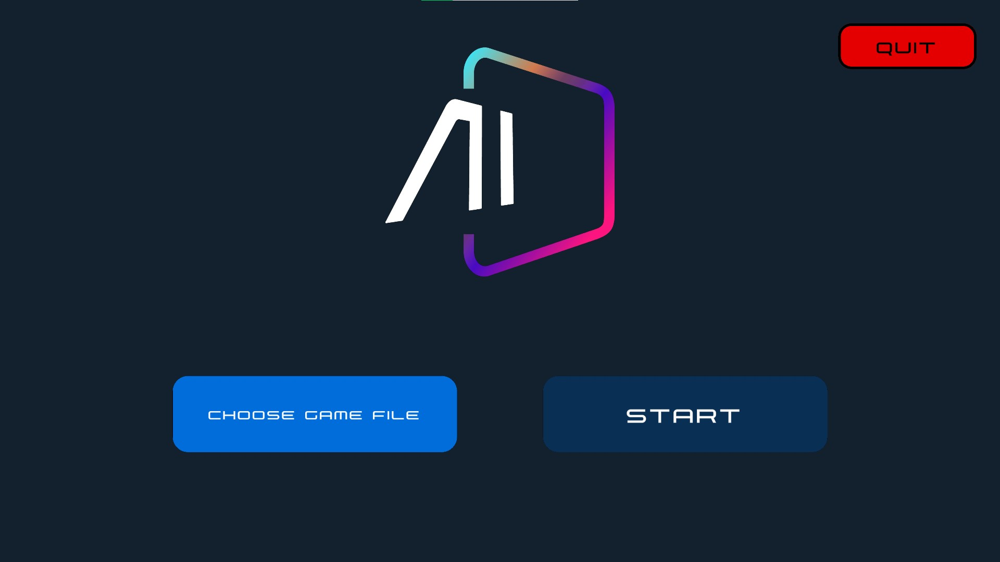
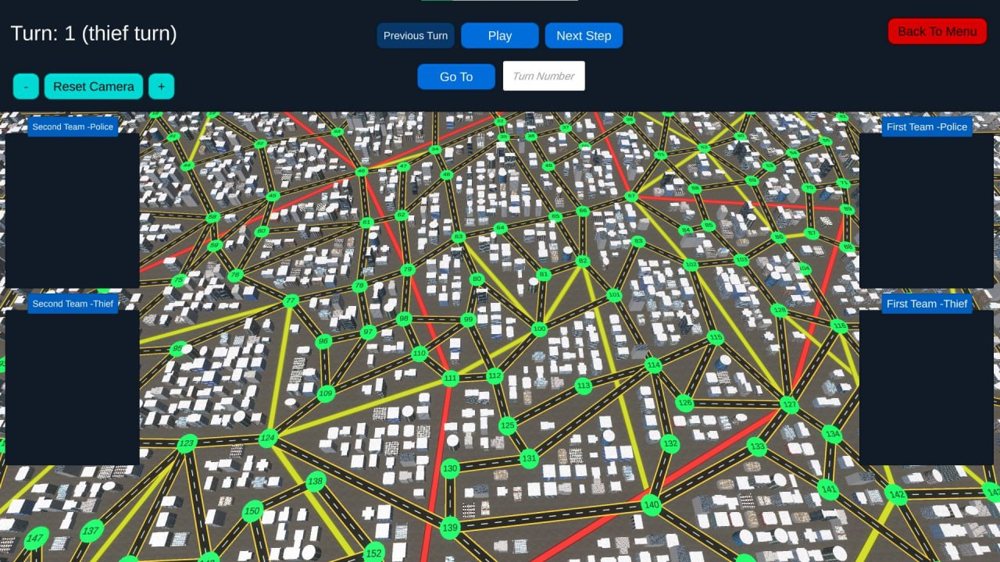
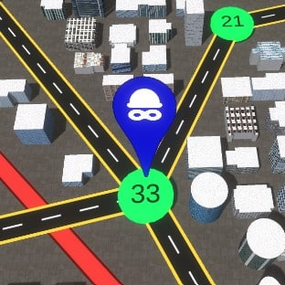
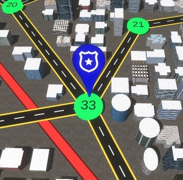

# Sharif AI Challenge 2022

Sharif AI Challenge is a programming competition for all who are interested in artificial intelligence.This competition is held in two phases annually. Including an online and an on-site phase in which competitors will compete in teams of three.

The only pre-requisite to enter this competition is familiarity with programming using C++, Java or python. But obviously, knowledge of algorithmic thinking and artificial intelligence will be a great asset for any of the participating teams. You can find more details about this competition in this [Link](https://aichallenge.ir/)

In this repository, you can find our team's final submission in the final stage of this competition held in 2022 at Sharif University of Technology. We developed our AI program using Python programming language.

## Game
The game is played by two players, each player has a number of thieves and a number of policemen, and the goal of each player in this game is to use his policemen to catch the opponent's thieves, until the end of the game, whichever player catches the opponent's thieves faster will win the game. Each player must be able to move his cops around the city map in such a way that they fall on the opponent's thieves and catch them. Here we provide our code, which controles the policemen and theives in an efficient way.




The game is played on a map, which is a map of a city, where a graph is a maximum of 250 vertices, and the vertices are the neighborhoods of that city, and its edges are traversable passages (which exist in three forms: side walk, subway, and taxi). There is no cost to use side walk, but there is a certain cost to use taxi and metro. Exactly one of the vertices of the graph is the police station. Two players play on this map, each player has a number of thieves and a number of policemen. At the beginning of the game, all the policemen are in the police station, and the initial location of the thief is in the hands of the players and they determine it at the beginning of the game.

During the game, the polices are always visible to the players, but the thieves are only visible to the opponent in certain turns of the game. The goal of each player is to catch the thieves of the opponent's player, and this happens when a policeman and the opponent's thief are on the same vertex, and the player who all his thieves get caughted first, his opponent wins.




Our team's final submission is available at `AIC22-Client-Python`. There is also another random client at `AIC22-Client-Python2`.

## Run
In order to run this program, you need to run the game's server, and pass the two competitors saved files, map as a json file, and information about the game as a yml file.

#### 1. Make client
After making changes in client code, run the command below.
```bash
pyinstaller --onefile /path/to/Client.py
```
After that, two folders `dist` and `build` and a `client.spec` file will be created. Path to `dist/Client` should be pass to the server, which is an executable binary file.
After every changes applied to the client, this process should be repeated.

#### 2. Run on Server
For running the server, java version 16 or higher is required. run the command below.

```bash
java -jar server.jar --first-team="<path to first team code>" --second-team="<path to second team code>" "<path to map.yml file>" "<path to map.json file>"

```
Different maps and game information files are provided in `server/resources`.
You can also do all the above process by running the below shell command.
```bash
sh run.sh
```

#### Requirements
- Python 3.9 or higher.
- Java 16 or higher.
- numpy 1.22 or higher.
- pyinstaller 5.2 or higher

The Code is written in Python 3.9. If you don't have Python installed you can find it [here](https://www.python.org/downloads/). If you are using a lower version of Python you can upgrade using the pip package, ensuring you have the latest version of pip. To install the required packages and libraries, run this command in the project directory after [cloning](https://www.howtogeek.com/451360/how-to-clone-a-github-repository/) the repository:
```bash
pip install -r requirements.txt
```

## Technical Aspects
We use classic graph related algorithms for finding distances and shortest path between two nodes in the given graph such as `Floyd-warshal` and `Dijkstra`. our code can be divided into three parts.

> How to split the theives at the beginning of the game?

We try different approches and the end we concluded that, the best possible answer is splitting the thieves in a way that they have the farthest distance to the police station and be far from each other as possible.

> Police movement

Police movement depends on different parameters but in short the main idea behind its' movement is that it tries to find the nearest theif nearby it and move toward that target. Also, polices move in different directions and most of them have different target in order to prevent collisons and catch theives faster.

> Theif movement

Thief movement depends on different parameters but in short the main idea behind its' movement is that it tries to find the safest neighbour of its location depends on location of opponents' policemen and move toward that target. Also, thieves move in different directions (unless it was necessary) in order to prevent collosions and make the losses as low as possible.


